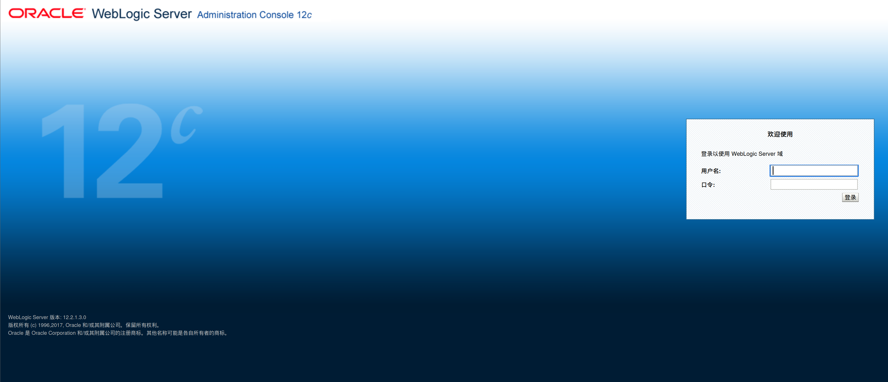
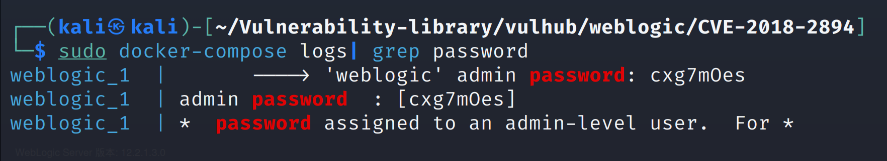
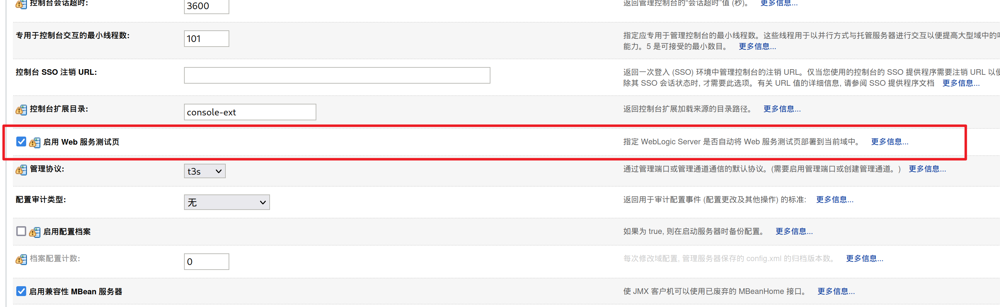
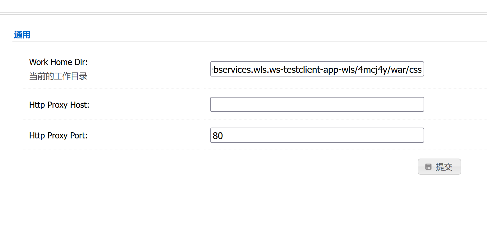
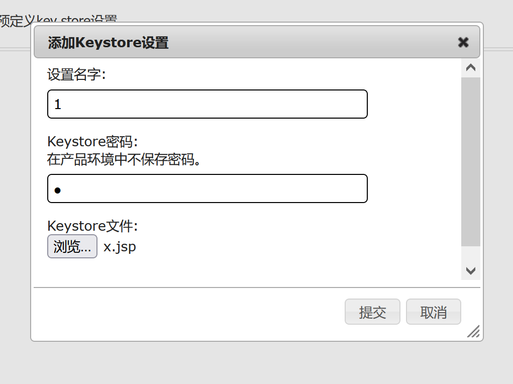
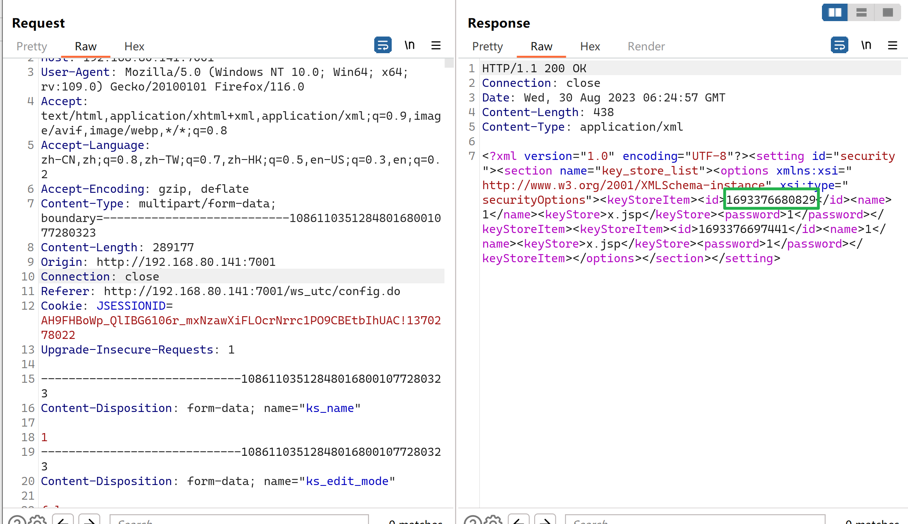
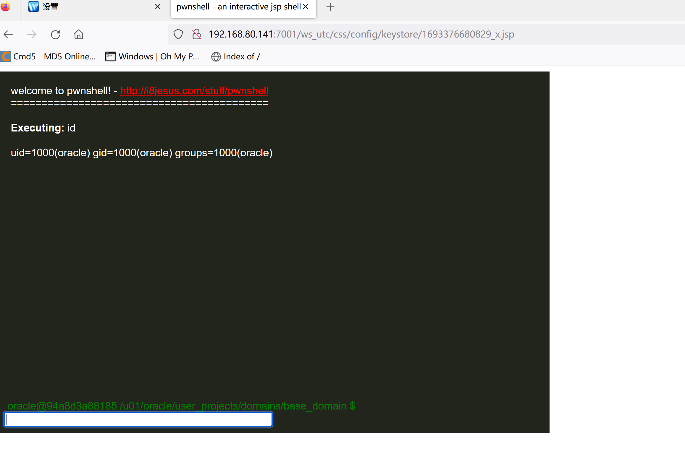

# weblogic/CVE-2018-2894

> 复现环境：Vulhub

访问 http://192.168.80.141:7001/console/，即可看到后台登录页面

执行`sudo docker-compose logs | grep password`可查看管理员密码，管理员用户名为`weblogic`。

密码为：`cxg7mOes`

登录后台页面，点击`base_domain`的配置，在“高级”中开启“启用 Web 服务测试页”选项：

#### 漏洞复现

访问`http://192.168.80.141:7001/ws_utc/config.do`

设置Work Home Dir为`/u01/oracle/user_projects/domains/base_domain/servers/AdminServer/tmp/_WL_internal/com.oracle.webservices.wls.ws-testclient-app-wls/4mcj4y/war/css`。我将目录设置为`ws_utc`应用的静态文件css目录，访问这个目录是无需权限的

设置好后点击提交

然后点击安全 -> 增加，然后上传`jsp后缀`webshell：

上传后，查看返回的数据包，其中有时间戳：

时间戳：`1693376680829`

上传的文件：`x.jsp`

然后访问`http://192.168.80.141:7001/ws_utc/css/config/keystore/[时间戳]_[文件名]`，即可执行webshell：

